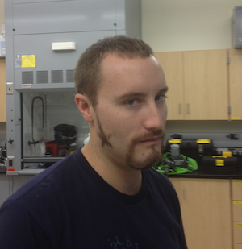

```{r setup, include=FALSE}
knitr::opts_chunk$set(echo = TRUE)
```

# R Markdown
This is an R Markdown document. Markdown is a simple formatting syntax for authoring HTML, PDF, and MS Word documents. For more details on using R Markdown see <http://rmarkdown.rstudio.com>.

When you click the **Knit** button a document will be generated that includes both content as well as the output of any embedded R code chunks within the document. You can embed an R code chunk like this:

## Markdown syntax

Because Rmarkdown uses markdown syntax, it's easy to include *italic* and **bold** text.

There are many more things we can do with markdown:
We can include super^script^ in normal text

Put formatted code inline by surrounding it with backticks ( \`code between\` ) `like this`

We can include equations using the following format:`$A = /pi*r^2$`

$A = \pi*r^2$

We can run R code *inline* by surrounding with backticks and denoting the code is R ( \` r function( )\` ). Only the results will display: Today is `r format(Sys.Date(), format="%B %d, %Y")`.

We can separate sections with solid lines

***

We can even include pictures and figures not generated in R by using markdown syntax: ``



# There are 6 different Heading levels

## 2

### 3

#### 4

##### 5

###### 6

## Code chunks
We can include code chunks in our document so we can see the code that generated a specific output. We signify a code chunk with 3 backticks (\`\`\`) at the begining and the end of the chunk. We also include in curly brackets ( { } ) the language, chunk name, and any parameters for the specific chunk.
```{r iris}
summary(iris)
```

## Including Plots

You can also embed plots, for example:

```{r pressure, echo=FALSE}
plot(cars)
```

Note that the `echo = FALSE` parameter was added to the code chunk to prevent printing of the R code that generated the plot.

# Using Rmarkdown as a notebook and for reproducible code
We can use this document to work on our data analysis---we can describe what we're doing and why. We can include the code to run the analysis and write our notes and interpretation.
This way we can come back to our document and see what we've don, or share it with collaborators.

This is the way that *I* would use it:
***

# Fisher's Iris data analysis example

## Set R environment and load packages
First things first, let's setup our R environment.
We start by setting and overarching knitr options as in the code chunk below:

```{r, setup1, include = TRUE}
knitr::opts_chunk$set(warning = FALSE, fig.align = 'left', fig.dim = c(4,4))
# If we wanted to use real data housed in a folder at the same directory level as our present working directory (i.e. "code/") we could use the following to set the directory to the "data" directory. Two periods(..) means the containing directory. So below we are saying our ne working directory is the "data" folder in the folder which also contains the "code" folder.

# knitr::opts_knit$set(root.dir = '../data')

options(width = 88)
```

I kept this chunk in the final knitted document, but normally I wouldn't because this is just telling knitr how to handle our code chunks and doesn't really affect our actual data analysis in R. If you look at the .Rmd you can see the same chunk below, but it is not in the final .html document:
```{r, setup2, include = FALSE}
knitr::opts_chunk$set(warning = FALSE, fig.align = 'left', fig.dim = c(4,4))
# If we wanted to use real data housed in a folder at the same directory level as our present working directory (i.e. "code/") we could use the following to set the directory to the "data" directory. Two periods(..) means the containing directory. So below we are saying our ne working directory is the "data" folder in the folder which also contains the "code" folder.

# knitr::opts_knit$set(root.dir = '../data')

options(width = 88)
```

See? Or rather, don't see? We can do this by including `include = FALSE` in the code chunk header.
<br><!--this is an html line break, but everything in between these arrows are a .Rmd comment so you wont see this in the final document-->
Now let's get all our packages together. Using `pacman` is really nice because we don't have to include a ton of `install.packages()` and `library()` statements. You can read more about `pacman` [here](https://github.com/trinker/pacman/blob/master/README.md){target="_blank"}.
```{r, load packages, include = TRUE, message = FALSE, warning = FALSE, results = 'hide'}
if (!require("pacman")) install.packages("pacman")
pacman::p_load("paletteer", "patchwork", "tidyverse", "vegan")
pacman::p_load_gh("pmartinezarbizu/pairwiseAdonis/pairwiseAdonis")

```

## Violin plots of morphometric data
We are using the data from Fisher's Irises.
Let's look at how different species vary acros flower morphometric measures.
<br>
First, Im setting a blanket theme for my plots.
```{r ryanTheme}
ryanTheme = theme(axis.title = element_text(color = "black", size = 12),
                  axis.ticks = element_blank(),
                  axis.text = element_text(color = "black", size = 12),
                  legend.title = element_text(color = "black", size = 12),
                  legend.text = element_text(color = "black", size = 12),
                  legend.key = element_blank(),
                  legend.background = element_blank(),
                  panel.border = element_rect(color = "black", size = 1.2),
                  panel.grid = element_blank(),
                  plot.background = element_blank()
             )
```

We can see that our data has four measurements
```{r fisher iris data}
head(iris)
```

Let's make a violin plot for each metric:
```{r violin plots}
# Plot for Sepal Length
slPlotA = ggplot(iris, aes(y = Sepal.Length, x = Species, fill = Species)) +
  geom_violin(alpha = 0.5) +
  geom_point(shape = 21, color = "black",
             size = 1.5, position = position_jitterdodge(1)) +
  scale_fill_manual(values = paletteer_d("wesanderson::GrandBudapest1")) +
  xlab("Species") +
  ylab("Sepal Length (cm)") +
  theme_bw()

slPlot = slPlotA +
  ryanTheme +
  theme(legend.position = "none")
  
slPlot

# Plot for Sepal Width
swPlotA = ggplot(iris, aes(y = Sepal.Width, x = Species, fill = Species)) +
  geom_violin(alpha = 0.5) +
  geom_point(shape = 21, color = "black",
             size = 1.5, position = position_jitterdodge(1)) +
  scale_fill_manual(values = paletteer_d("wesanderson::GrandBudapest1")) +
  xlab("Species") +
  ylab("Sepal Width (cm)") +
  theme_bw()

swPlot = swPlotA +
  ryanTheme +
  theme(legend.position = "none")
  
swPlot

# Plot for Petal Length
plPlotA = ggplot(iris, aes(y = Petal.Length, x = Species, fill = Species)) +
  geom_violin(alpha = 0.5) +
  geom_point(shape = 21, color = "black",
             size = 1.5, position = position_jitterdodge(1)) +
  scale_fill_manual(values = paletteer_d("wesanderson::GrandBudapest1")) +
  xlab("Species") +
  ylab("Petal Length (cm)") +
  theme_bw()

plPlot = plPlotA +
  ryanTheme +
  theme(legend.position = "none")
  
plPlot

# Plot for Petal Width
pwPlotA = ggplot(iris, aes(y = Petal.Width, x = Species, fill = Species)) +
  geom_violin(alpha = 0.5) +
  geom_point(shape = 21, color = "black",
             size = 1.5, position = position_jitterdodge(1)) +
  scale_fill_manual(values = paletteer_d("wesanderson::GrandBudapest1")) +
  xlab("Species") +
  ylab("Sepal Length (cm)") +
  theme_bw()

pwPlot = pwPlotA +
  ryanTheme +
  theme(legend.position = "none")
  
pwPlot
```

## Combining and saving figures
We generated four plots based on the morphometric measurements of the three *Iris* spp.
Now we can combine them into a single figure for publication.
We can use the R package `patchwork` which uses really simple syntax to combine figures---read more about it [here](https://patchwork.data-imaginist.com/articles/patchwork.html){target="_blank"}.

The nice thing is that we can also easily add plot designators, like letters or numbers, and we can specify what we want to use (journal dependent).
```{r combine plots, fig.dim = c(5.91, 5.91)}
irisPlots = (plPlot | pwPlot) / (slPlot | swPlot) +
  plot_annotation(tag_levels = "A") &
  theme(plot.tag = element_text(size = 14, face = "bold"))

irisPlots
```
Looks great! Patchwork automatically scales each plot to match the height and width of the row/column.

Now let's save it for our publication. I like to use .tiff or .eps for high resolution figures. You want at least 300 dpi so figures are clear for printing.
```{r save iris plot}
ggsave("../figures/Figure1.tiff", plot = irisPlots, height = 15, width = 15, units = "cm", dpi = 600)
```
Done! Now it's in the folder labeled "figures"
We saved as a .tiff because exporting as a .eps wont handle the transparency we used on our violin plots.

## Run non-metric multidimensional scaling (nMDS)
Now let's see how each flower plots in ordination space. We can try nMDS out with this data.
```{r Iris example, echo = TRUE, results = 'hide'}
set.seed(694) #make random starts the same everytime (pick a number, any number)

irisNMDS = metaMDS(iris[1:4], trymax = 200, autotransform = TRUE, distance = "euclidean")
irisNMDS

irisScores = as.data.frame(scores(irisNMDS))
irisScores$species = factor(iris$Species)
```
We hid the results above so we don't wee the output of the nMDS calculation (you could include if you wanted, it could be up to as many lines as you set in `tryamx =`.)

```{r show iris df}
head(irisScores)
```

## Build nMDS biplot
Now we can take the data that we compiled from running nMDS on the *Iris* spp. data and build our ordination plots using `ggplot2`, a part of the `tidyverse`.
Now to plot the nMDS
```{r, iris nMDS plot, fig.dim = c(4.72, 4.72)}
irisNMDSPlotA = ggplot() +
  geom_point(data = irisScores, aes(x = NMDS1, y = NMDS2, fill = species), color = "black", shape = 21, size = 4) +
  scale_fill_manual(values = paletteer_d("wesanderson::GrandBudapest1"), name = "Species") +
  annotate("label", x = 3.1, y = 1.5, label = paste("Stress = ", round(irisNMDS$stress, 2), sep = ""), size = 4) +
  labs(x = "nMDS1", y = "nMDS2") +
  theme_bw()

irisNMDSPlot = irisNMDSPlotA + 
  ryanTheme +
  theme(legend.position = c(.85,.15),
        axis.text = element_blank()
        )

irisNMDSPlot
```
From the nMDS ordination we can see that all the Irises are grouped by species but *Iris setosa* groups away from *I. vericosa* and *I. virginica*.

Now let's save it
```{r save nmds plot}
ggsave("../figures/Figure2.eps", plot = irisNMDSPlot, height = 12, width = 12, units = "cm", dpi = 600)
```
Done!

## Permutational multivariate analysis of variance
We see that there are clear groupings by species in ordination space, but now let's follow up and look at the *statistical differences* using PERMANOVA. We can do this with the `adonis` function in the R package *vegan*.
```{r PERMANOVA}
adonis(iris[1:4]~iris$Species, method = "euclidean", permutations = 999)
```
PERMANOVA indicates a significant difference in morphometric measures between species

## Pairwise PERMANOVA
Since we saw significant differences between species we should look at what species are different from one another.
We can use pairwise PERMANOVA with FDR corrected *p*-values to do the pairwise comparisons.
Let's use the package `pairwiseAdonis` to check it out.
```{r pairwise PERMANOVA}
pairwise.adonis(iris[1:4], factors = iris$Species, sim.method = "euclidean", perm = 999, p.adjust.m = "BH")
```
Cool---we can see that all three *Iris* spp. are significantly different from one another in terms of flower morphometrics!

***

# Customization
This was just a quick example of **some** of the things you can do with Rmarkdown.

There are not only numerous formats you can *Knit* your document to, there are tons of arguments you can include in code chunk headers and the YAML header to customize the output of your document.  

Test things out and see what you can do on your own, using some of your own data.

Using html and markdown, the possibilities are nearly endless :)

Take it, make it yours, have fun!

